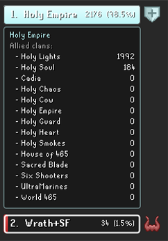
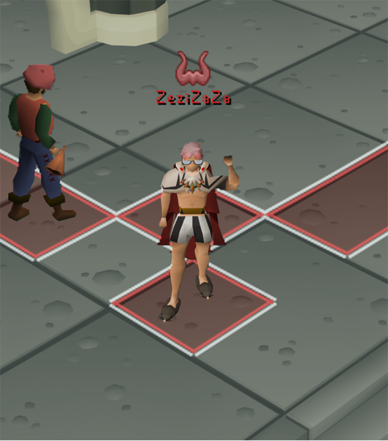
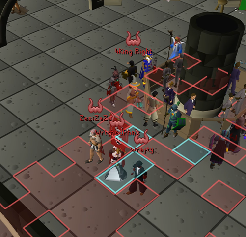
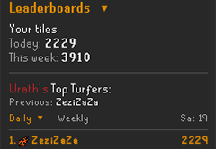
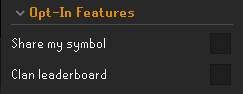
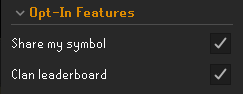

# Clan Turf

There are exactly 2,210 tiles you can stand on at the Grand Exchange, and Clan Turf turns every one of them into contested territory for your clan. Walk across a tile to claim it, stamped in your clan's color; step onto a rival's and it flips to yours. A live sync server shows every clan's turf in real time, per world, so the whole GE becomes a running turf war that resets fresh each day.

## Where to find things 

Clan Turf has two homes. The **Clan Turf side panel**, opened from the RuneLite sidebar, is your live dashboard for the scoreboard, Active Battles, alliance controls, Community Claims, and the offline sandbox.

Everything you can toggle or customize, from visuals and sounds to clan colors and alliance player indicators, is found in the plugin's **settings** under the wrench (Configuration) button.

Throughout this README, "in the panel" refers to the Clan Turf side panel, while any bold setting name refers to an option found in the plugin's settings.

## Claim turf by walking

Step on any Grand Exchange tile to claim it for your clan. Walk onto a rival's tile and it becomes yours, so contested ground changes hands as clans move across it. Each clan's territory is filled and outlined in its own color and grouped into clean regions instead of a thousand little squares. Where two clans meet, the border splits into two lines so the seam is always clear.

As you run, an optional trail effect marks your path in your clan's color: a slick ripple of little walls that cascades out behind you before fading away. Not in a clan? The trail runs neutral white, so you still get the walking visual at the GE even though you can't claim.

## The takeover

When a clan takes the GE lead, the boundary rises into a colored wall before settling into the new owner's color. Nearby tiles shimmer and a takeover announcement and sound cue can fire. Individual rival tiles also get a short takeover effect, with a flat-line option for a subtler look.

## The crowd reacts

Take the GE while you're standing in it and the whole cast of Grand Exchange NPCs calls it out overhead, each with lines that fit their character. The chatter appears in the game's overhead yellow with your clan's name picked out in its color, announced in a stagger rather than all at once. It only fires on an ownership flip, and nothing is ever posted to the chat box. Toggle it with **NPC takeover text**.

## Pre-claimed pockets

Parts of the Grand Exchange aren't walkable: the stools, the stalls, the walls, the foliage. By default these pockets only fill in a clan's color where that clan's claims already surround them, so a fresh GE stays clean. Turn on **Show Pre-Claims** and every pocket fills in the current owner's color (white while the GE is unclaimed), so a clan's turf reads as one solid block and the pockets recolor on takeover right along with the boundary. Either way it is purely cosmetic: these tiles are never claimable and never counted.

## The war on the map

The GE is tinted on your minimap in the current owner's color. On the world map, the GE is outlined and filled with the owner's color and clan name, letting you see who controls it without being there. Multi-word clan names stack one word per line.

## Live scoreboard

The side panel ranks every clan on your world by tiles held, with each clan's share of the GE. The bars slide into place as the fight unfolds. An alliance carries its symbol on the right of its bar. Click that symbol to expand the bar into a breakdown of how many tiles each allied clan has put in, while the bar itself keeps showing the team's combined total. Click again to collapse it.

## Active battles

The **Active battles** list in the side panel shows which worlds are contested, with the leading clan and closest rival for each world, so you know where to head next. Your current world always stays pinned at the top; click the **Tiles**, **World**, or **Owner** header to sort the rest, and click again to flip the direction.

## Alliances

Team up with other clans. One clan creates an alliance and shares a passcode; any clan that joins is treated as one team: allied clans stop taking each other's tiles, and their combined turf shows in a single shared color and counts as one clan on the scoreboard, the leader, and the Active Battles board that everyone sees. Two clans in the middle of a fight can trade a code and merge their tiles on the spot.

### Creating one

Alliances live in a collapsible **Alliance** section in the side panel, and only your clan's leadership (Owner, Deputy, or Admin) can set one up. Give it a name (up to two words, ten letters each), pick a shared color and one of the game's official clan symbols, and set a passcode, or leave it blank and one is generated for you. Hit **Create alliance** and your clan owns it.

### Joining one

Get the passcode from whoever runs the alliance, drop it into the **Join an alliance** box in the same panel, and hit **Join alliance**. That is the whole handshake, no invites and no waiting. Your clan's turf immediately merges into the alliance's color and total.

### Running it

The clan that created the alliance owns it: from the panel it can recolor the alliance, change its symbol, copy or change the passcode (click the passcode to copy it), remove a clan, or disband the whole thing. A clan that only joined gets a **Leave alliance** button instead. A removed or blocked clan is listed in the **Blocked clans** field under the Alliances settings section and cannot rejoin until you take it back off that list. Prefer a different shade for your own eyes? Clicking your own clan's scoreboard bar to pick a local color still overrides the alliance color for your view only.

The alliance symbol shows everywhere the alliance does: large above the name on the world map, on its scoreboard bar, and beside its name in the panel. The passcode is just a code you make up to control who can join. It is never your RuneScape or Jagex account password, and Clan Turf will never ask for that.

### Home world

Every alliance can claim a **home world**. Set it when you create the alliance (it defaults to your clan's in-game home world), or change it any time from **Alliance Tools > Change home world** in the side panel; only the owner clan's leadership can set it. Your alliance's home world shows under its name in the panel and in the scoreboard drop-down, and a gold **[HW]** tag appears beside an alliance in Active Battles whenever the fight is on its own home world, so you can spot who is defending home turf. Alliances made before this feature start with no home world until an owner sets one.

### Player indicators

The alliance's symbol, in the alliance color, floats over the heads of alliance members around you, so in a crowded fight you can pick out who is on your side at a glance. You see other members' symbols whether or not you opt in: your own clanmates are tagged automatically from local data, and players from *other* clans in your alliance appear once they turn it on. Turning on **Share my symbol** opts *you* in - it adds your name and alliance to a public roster that everyone running Clan Turf can read, so others can see your symbol over your head. Only your name and alliance are ever shared, never your location, and you are removed from the roster shortly after you turn it back off.

By default the symbols show only while you are at the Grand Exchange and fade out as you leave (**Hide indicators outside GE** controls that). **Show names** adds the player's name under the symbol, skipping anyone the Player Indicators plugin or your own friends, clan, or team already name so nothing doubles up, and **Indicator opacity** sets how strong the symbol looks (set it to 0 to hide them). The opt-in **Share my symbol** toggle lives in the **Opt-In Features** settings section; those three display options sit under **Alliances**.

 

## Rally your clan in chat

Type `!defend 307` or `!invade 420` in clan chat (`!def` and `!inv` also work) to send a formatted rally call in the target clan's color. Commands are validated against the live board so only real targets are announced.

## Leaderboards

Track how many Grand Exchange tiles you claim each day and week, and rank your clan for internal events. Your own daily and weekly counters live in the side panel's Leaderboards section, run locally, and reset on their own at 00:00 UTC (daily) and Monday 00:00 UTC (weekly).

Everyone in your clan can view the board (opted in or not), sortable by daily or weekly total like the Active Battles list. Turn on the **Clan leaderboard** toggle in the Opt-In Features settings to add your own tiles to it: only opted-in players appear, only your name, clan, and tile counts are sent (never your location), and turning it off removes you. Your personal counter shows whether or not you opt in.

## Community Claims

At the bottom of the side panel, a running all-time counter tracks every tile claimed or stolen across every clan and world since launch. It never resets with the daily wipe. Your claims update instantly, while community claims periodically roll in.

## Pick your clan colors

Every clan is auto-assigned its own color, but you can override any of them. Hover a bar in the side panel to highlight it and click to open the color wheel, then pick a color for your own clan or a rival's. Your picks are saved to a local color list you can copy and paste to share a whole palette with clanmates. It's all local, so everyone else still sees their own colors.

Colorblind? A **Colorblind mode** in the settings adjusts every clan color, auto and custom alike, to be easier to tell apart: protanopia, deuteranopia, or tritanopia.

## Offline mode

Flip the **Online/Offline** toggle at the top of the panel to Offline and Clan Turf runs local-only: you see just your own claims, nothing is sent, and an **Offline Tools** box opens with a little sandbox to mess around in:

- **Clear all tiles** wipes the current world's local claims.
- **Full Slug** paints every tile you cross, not just the one you land on, so you can fill areas fast.
- **Surrender tiles** flips your steps into an eraser, wiping claimed tiles back to unclaimed. With Full Slug on it erases everything you cross; off, just the tiles you walk over.
- **Claim tiles as** lets you add test clans and switch which one you're painting, so you can lay out a whole battle yourself. Recolor any clan by clicking its scoreboard bar; offline picks are saved in a separate list so they never touch your online one.

## Daily reset

All turf wipes daily at 00:00 UTC. An on-screen countdown and clan warnings give you time to finish a battle, while the reset dissolves tiles in a staggered fade.

## Usage

1. Enable the plugin.
2. Join a clan if you aren't in one. Turf is claimed for your clan, so you need one to take ground.
3. Head to the Grand Exchange and walk across tiles to claim them.
4. Watch the side panel for the live standings and the Active Battles board.
5. Rally the clan by typing `!defend <world>` or `!invade <world>` in clan chat.
6. Keep an eye on the reset countdown so you aren't caught mid-fight.

## Configuration

### Appearance

- **Tile fill opacity** - How solid claimed tiles look.
- **Draw tile outline** / **Tile outline opacity** - Outline each clan's territory, and how strong it is.
- **Tint GE on minimap** / **Minimap opacity** - Shade the GE on the minimap in the owner's color, and how strong.
- **Tint GE on world map** / **Worldmap opacity** - Shade and outline the GE on the world map in the owner's color with the clan name (works anywhere), and how strong the tint is.
- **Show GE boundary** - Draw the GE border line on screen.
- **Show Pre-Claims** - Off by default. On, fill every unwalkable GE pocket in the owner's color (white when unclaimed) so turf reads solid; off, a pocket fills only where a clan's claims border it. Cosmetic; never counted.
- **Snail trail** - Leave a fading clan-colored trail behind you. Does not affect claims.
- **Tile walls** - Toggle all raised wall effects: tile captures, takeovers, and the snail trail.

### Takeover

- **Border animation** - On a takeover, raise the boundary into a wall, or just fade it to the new color (flat).
- **Announce takeovers** - Post a clan-tab message when the GE changes hands.
- **Takeover sound** / **Takeover volume** - Play a cue on takeover, and set how loud.
- **NPC takeover text** - When the GE changes hands while you're there, the Grand Exchange NPCs react with overhead chatter naming the new owner, in that clan's color with a little wave. Visual only, never posted to chat.

### Clan

- **Clan chat commands** - Turn `!defend` / `!invade` in clan chat into rally calls.
- **Custom clan colors** - Apply your local clan color list (below). Off = every clan uses its auto color.
- **Online color list** - Per-clan colors for the live game as `ClanName=RRGGBB`, comma-separated. Set them by clicking bars in the side panel while online; copy and paste to share.
- **Offline color list** - Same format, but for the offline sandbox only, so test-clan colors stay out of the shareable list.

### Opt-In Features

Opt-in extras that share a little extra data. Each toggle's description spells out exactly what it sends, and you can go Offline at any time to stop entirely.

- **Share my symbol** - Off by default. Put your alliance symbol over your own head so others can spot you. You see other opted-in players' symbols whether or not this is on; turning it on opts you in so they can see yours - your name and alliance are added to a public roster everyone running Clan Turf can read. Only your name and alliance are sent, never your location, and you're removed shortly after you turn it off.
- **Clan leaderboard** - Off by default. Everyone in your clan can view the board; turning this on opts you in so your own tiles are added to it. Your name, clan, and daily/weekly tile counts are sent. Only opted-in players appear - turn it off to be removed. Your own tile counter shows either way.

 

### Alliances

- **Show names** - On by default. Also draw the player's name under the symbol, skipping anyone Player Indicators or your own friends, clan, or team already name so names never double up.
- **Hide indicators outside GE** - On by default. Only show the symbols at the Grand Exchange; they fade out as you leave. Local only.
- **Indicator opacity** - Max opacity of the overhead alliance symbol and name (0 = invisible, 100 = full).
- **Blocked clans** - Clan names, comma-separated, barred from joining your alliance (only applies while your clan owns one). The kick x in the Alliance panel adds a name here; remove one to un-block that clan.

### Network

- **Use sync server** - Sync with other clans so the war is live (on by default). Off for local-only, nothing sent.
- **Server URL** - The sync server address. Leave as-is unless you run your own.

### Extras

- **Reset countdown** - Show the countdown and clan warnings before the daily reset.
- **Colorblind mode** - Daltonize all clan colors for easier separation: protanopia, deuteranopia, or tritanopia.
- **Show update messages** - Print a short changelog in the chat box the first time you log in after the plugin updates.

## Notes

- **Turf is per clan and per world.** You need to be in a clan to claim anything, and each world's Grand Exchange is its own separate battleground.
- **For the best look, pair it with [Improved Tile Indicators](https://runelite.net/plugin-hub/show/improved-tile-indicators).** Enable **Draw overlays below player** and **Draw overlays below NPCs**, then add the GE NPCs to **NPCs to draw on top**. Pets can be set to **Draw below** via shift + right-click.
- **What gets sent to the server.** With sync enabled, Clan Turf sends your clan name, claimed GE tile coordinates, and current world number. If you create or join an alliance, it also sends the alliance name, color, symbol, and passcode you enter. If you turn on **Share my symbol**, it additionally sends your player display name paired with your alliance, so you can be shown over your own head to others. This is opt-in, is removed shortly after you turn it off, and never includes your location. If you turn on the **Clan leaderboard**, it additionally sends your display name, clan, and daily/weekly tile counts so your clan's opted-in board can be shown - also opt-in, removed when you turn it off, and never your location. No account details, passwords, or location tracking are sent. Syncing pauses when you log out.
- **No automation.** Clan Turf reads your position and draws overlays. Clan chat commands only read clan messages and display local formatted text. It never moves your character, sends chat, or performs automated game actions.
