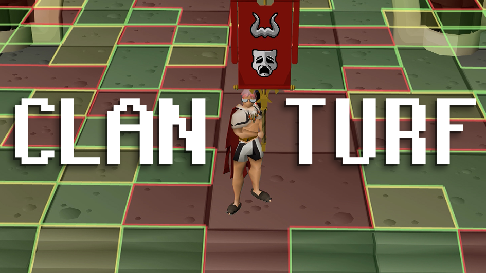
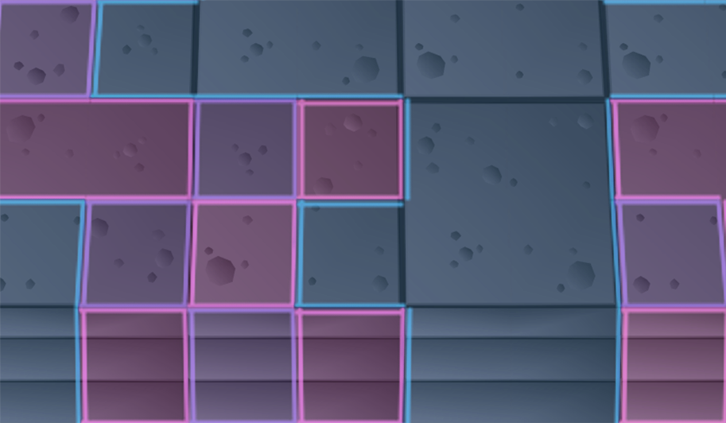
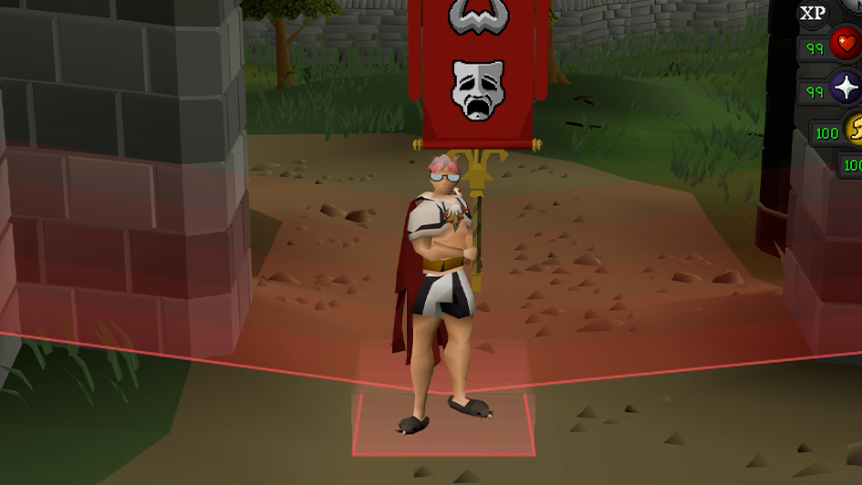
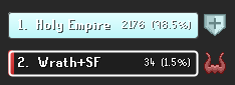
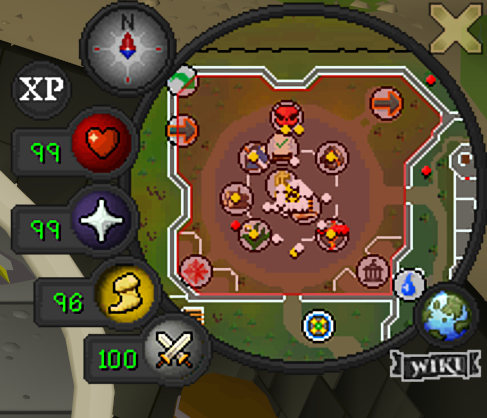

# Clan Turf

Turn the Grand Exchange into contested territory for your clan. Walk across GE tiles to claim them for your clan, stamped in your clan's color. Step onto a rival clan's tile and it flips to yours. A live sync server shows every clan's turf in real time, per world, so the whole GE becomes a running turf war that resets fresh each day. The plugin only reads where you walk and draws the map. It never moves your character or sends any input.

## Claim turf by walking

Step on any Grand Exchange tile to claim it for your clan. Walk onto a rival's tile and it becomes yours, so contested ground changes hands as clans move across it. Each clan's territory is filled and outlined in its own color and grouped into clean regions instead of a thousand little squares. Where two clans meet, the border splits into two lines so the seam is always clear.

## The takeover

When a clan seizes the lead for the GE, the boundary rises into a colored wall that swaps to the new owner's color and settles back down, the winning clan's nearby tiles shimmer, and a call goes out in your clan tab with a sound cue. Want it subtler? A flat-line mode fades the border color without raising the wall.

## Live scoreboard

The side panel ranks every clan on your world by tiles held, with each clan's share of the GE. The bars slide into place as the fight unfolds.

## Active battles

See which worlds are contested and who currently holds them. Click **Invade** to hop straight to a rival's world, or **Defend** to jump to one your clan already holds.

## Rally your clan in chat

Type `!defend 307` or `!invade 420` in clan chat and it turns into a formatted rally call in the right clan's color, checked against the live board so only real targets go through. Every Clan Turf message lands in your clan tab, so you coordinate and get plugin alerts in one place.

## The war on your minimap

The Grand Exchange is shaded on your minimap in the current owner's color, so you can read who holds it at a glance.

## Daily reset

All turf wipes every day at 00:00 UTC, so no clan sits on a permanent claim and every day is a fresh fight. An on-screen countdown and clan warnings give you time to finish a battle before it hits.

## Practice offline

Want to experiment without touching the live war? Turn **Use sync server** off and Clan Turf runs local-only: you see just your own claims and nothing is sent anywhere. While it's off, the **Clear my tiles** button at the bottom of the side panel turns on, so you can wipe the current world's local claims and start fresh as many times as you like.

Heads up: the two controls live in different places. **Use sync server** is in the plugin settings (the wrench/settings tab), while **Clear my tiles** is at the bottom of the Clan Turf side panel. The button is always visible but stays greyed out and unclickable until the server is off, so it can never wipe shared turf.

## Tiles per hour

Turn on the **Tiles/hour tracker** for a little on-screen box, like an XP tracker, that shows three readouts: **Tiles Claimed** this session, your **Current TPH** (tiles per hour right now), and your **Max TPH** (the best rate you hit this session). It's a local, just-for-fun way to see how efficient your route is, and it works the same offline or live. Every claim counts, retaking a rival's tile included, so it's a running tally of your activity. Shift + right-click the box and pick **Reset** to start a fresh run anytime. It keeps counting across world hops and relogs, so a fight that spans worlds isn't wiped; only Reset (or turning the plugin off) clears it. Drag it anywhere you like.

## Also

- **Custom clan color.** Recolor your own clan's tiles to whatever you like. It stays local, so everyone else still sees their own colors.
- **Local-only mode.** Turn the sync server off to see just your own claims, no server involved.

## Usage

1. Enable the plugin.
2. Join a clan if you aren't in one. Turf is claimed for your clan, so you need one to take ground.
3. Head to the Grand Exchange and walk across tiles to claim them.
4. Watch the side panel for the live standings and the Active Battles board.
5. Rally the clan by typing `!defend <world>` or `!invade <world>` in clan chat.
6. Keep an eye on the reset countdown so you aren't caught mid-fight.

## Configuration

- **Tile fill opacity** - How solid claimed tiles look.
- **Draw tile outline** / **Tile outline opacity** - Outline each clan's territory, and how strong that outline is.
- **Show GE boundary** / **Border animation** - Draw the GE border, and whether a takeover raises the wall or just fades the flat line.
- **Tint GE on minimap** / **Minimap opacity** - Shade the GE on the minimap in the current owner's color, and set how strong that shading is.
- **Announce takeovers** - Post a message in the clan tab when the GE changes hands.
- **Takeover sound** / **Takeover volume** - Play a cue on takeover, and set how loud it is.
- **Tile effects** - Toggle the takeover shimmer and the small walls that rise on nearby tiles.
- **Custom clan color** / **Your clan color** - Recolor your own clan's tiles, just for you.
- **Clan chat commands** - Turn `!defend` / `!invade` typed in clan chat into rally calls.
- **Use sync server** - Sync with other clans so the turf war is live (on by default). Turn it off for local-only, where nothing is sent anywhere.
- **Reset countdown** - Show the on-screen countdown and clan warnings before the daily reset.
- **Tiles/hour tracker** - Show a local counter of tiles claimed this session, your current tiles-per-hour rate, and your session max. Shift + right-click it to reset.

## Notes

- **Turf is per clan and per world.** You need to be in a clan to claim anything, and each world's Grand Exchange is its own separate battleground.
- **For the best look, pair it with [Improved Tile Indicators](https://runelite.net/plugin-hub/show/improved-tile-indicators).** With that plugin installed, Clan Turf's tiles can be set to render underneath your character, pets, and NPCs instead of on top of them. Add the Grand Exchange NPCs to its "render below" list: Brugsen Bursen, Grand Exchange Clerk, Banker, Murky Matt (runes), Farid Morrisane (ores and bars), Abigaila, Perdu, Emblem Trader, Hofuthand (weapons and armour), Relobo Blinyo (logs), Bob Barter (herbs). You'll have to add your own pets manually.
- **What gets sent to the server.** With the sync server on, the plugin sends your clan name, the Grand Exchange region coordinates of the tiles you claim, and your current world number, so other clans' turf is visible to everyone. It sends no account details or personal information.
- **No automation.** The plugin reads your position and draws overlays. The clan chat commands only read clan messages to recognize the `!` commands and show local formatted text. It never moves your character, sends chat, or performs any automated game action.
