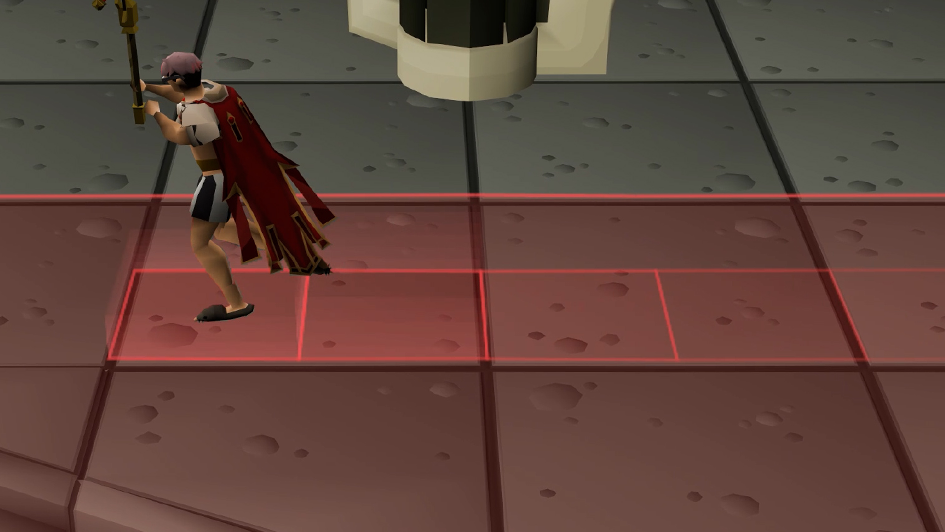
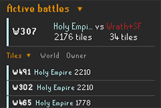
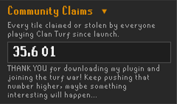
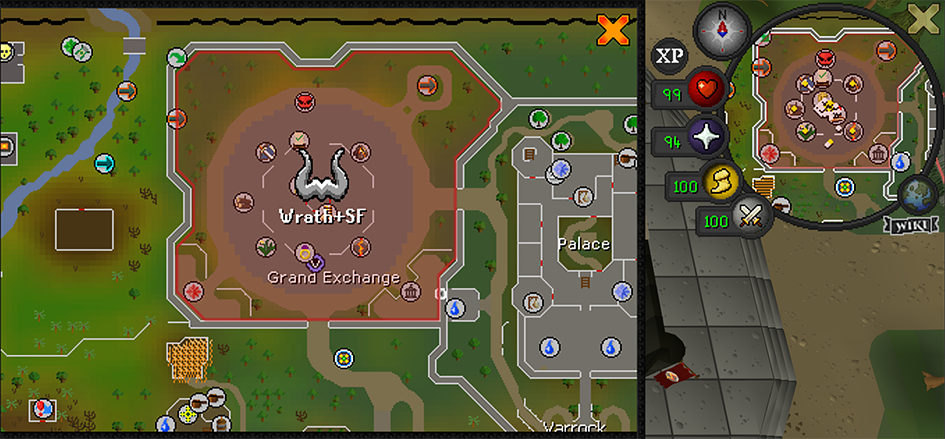
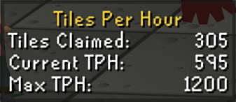
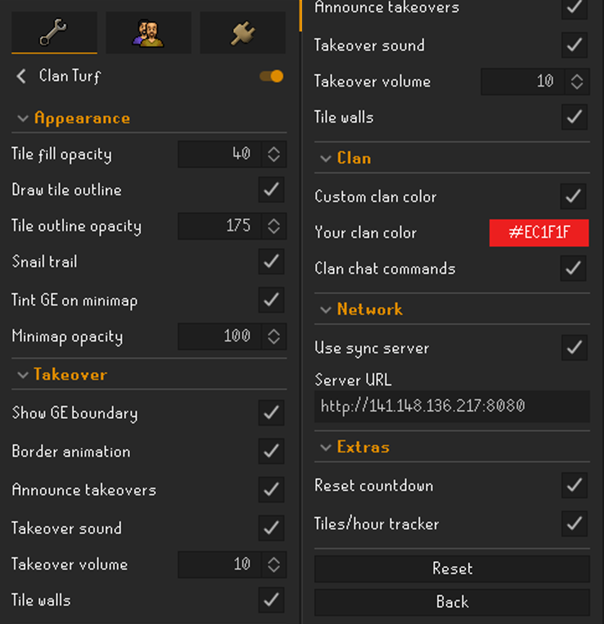

# Clan Turf

Turn the Grand Exchange into contested territory for your clan. Walk across GE tiles to claim them for your clan, stamped in your clan's color. Step onto a rival clan's tile and it flips to yours. A live sync server shows every clan's turf in real time, per world, so the whole GE becomes a running turf war that resets fresh each day.

## Claim turf by walking

Step on any Grand Exchange tile to claim it for your clan. Walk onto a rival's tile and it becomes yours, so contested ground changes hands as clans move across it. Each clan's territory is filled and outlined in its own color and grouped into clean regions instead of a thousand little squares. Where two clans meet, the border splits into two lines so the seam is always clear.

As you run, an optional trail effect marks your path in your clan's color - a slick ripple of little walls that cascades out behind you before fading away.

## The takeover

When a clan takes the GE lead, the boundary rises into a colored wall before settling into the new owner's color. Nearby tiles shimmer and a takeover announcement and sound cue can fire. Individual rival tiles also get a short takeover effect, with a flat-line option for a subtler look.

## Live scoreboard

The side panel ranks every clan on your world by tiles held, with each clan's share of the GE. The bars slide into place as the fight unfolds.

## Active battles

See which worlds are contested, with the leading clan and closest rival shown for each world. Click **Invade** to hop to a rival's world, or **Defend** to jump to one your clan already holds.

## Community Claims

A running all-time counter tracks every tile claimed or stolen across every clan and world since launch. It never resets with the daily wipe. Your claims update instantly, while community claims periodically roll in with a count-up animation. The counter shifts through increasingly rare colors as the total grows.

## Practice offline

The two buttons under Community Claims are the **Online/Offline** toggle and **Clear my tiles**. Offline mode lets you experiment with Clan Turf without connecting to the sync server. Only your local claims are shown and nothing is sent. **Clear my tiles** is available offline to wipe the current world's local claims.

## Rally your clan in chat

Type `!defend 307` or `!invade 420` in clan chat (`!def` and `!inv` also work) to send a formatted rally call in the target clan's color. Commands are validated against the live board so only real targets are announced.

## The war on the map

The GE is tinted on your minimap in the current owner's color. On the world map, the GE is outlined and filled with the owner's color and clan name, letting you see who controls it without being there. Multi-word clan names stack one word per line.

## Daily reset

All turf wipes daily at 00:00 UTC. An on-screen countdown and clan warnings give you time to finish a battle, while the reset dissolves tiles in a staggered fade.

## Tiles per hour

The **Tiles/hour tracker** shows **Tiles Claimed**, **Current TPH**, and **Max TPH** in a draggable overlay. It persists across world hops and relogs. Shift + right-click the tracker to **Reset run** or **Reset all**.

## Usage

1. Enable the plugin.
2. Join a clan if you aren't in one. Turf is claimed for your clan, so you need one to take ground.
3. Head to the Grand Exchange and walk across tiles to claim them.
4. Watch the side panel for the live standings and the Active Battles board.
5. Rally the clan by typing `!defend <world>` or `!invade <world>` in clan chat.
6. Keep an eye on the reset countdown so you aren't caught mid-fight.

## Configuration

- **Tile fill opacity** - How solid claimed tiles look.
- **Draw tile outline** / **Tile outline opacity** - Outline each clan's territory, and how strong it is.
- **Snail trail** - Leave a fading clan-colored trail behind you. Does not affect claims or TPH.
- **Show GE boundary** / **Border animation** - Draw the GE border, and whether a takeover raises the wall or fades a flat line.
- **Tint GE on minimap** / **Minimap opacity** - Shade the GE on the minimap in the owner's color, and how strong.
- **Show GE on world map** - Outline the GE on the world map in the owner's color with the clan name. Works anywhere.
- **Announce takeovers** - Post a clan-tab message when the GE changes hands.
- **Takeover sound** / **Takeover volume** - Play a cue on takeover, and set how loud.
- **Tile walls** - Toggle all raised wall effects, including tile captures, takeovers, and the snail trail.

- **Custom clan color** / **Your clan color** - Recolor your own clan's tiles. Local only.
- **Clan chat commands** - Turn `!defend` / `!invade` in clan chat into rally calls.
- **Use sync server** - Sync with other clans so the war is live (on by default). Off for local-only.
- **Reset countdown** - Show the countdown and clan warnings before the daily reset.
- **Tiles/hour tracker** - Show the tiles-claimed and TPH overlay. Shift + right-click to reset.

## Notes

- **Turf is per clan and per world.** You need to be in a clan to claim anything, and each world's Grand Exchange is its own separate battleground.
- **For the best look, pair it with [Improved Tile Indicators](https://runelite.net/plugin-hub/show/improved-tile-indicators).** Enable **Draw overlays below player** and **Draw overlays below NPCs**, then add the GE NPCs to **NPCs to draw on top**. Pets can be set to **Draw below** via shift + right-click.
- **What gets sent to the server.** With sync enabled, Clan Turf sends your clan name, claimed GE tile coordinates, and current world number. No account details or personal information are sent. Syncing pauses when you log out.
- **No automation.** Clan Turf reads your position and draws overlays. Clan chat commands only read clan messages and display local formatted text. It never moves your character, sends chat, or performs automated game actions.
