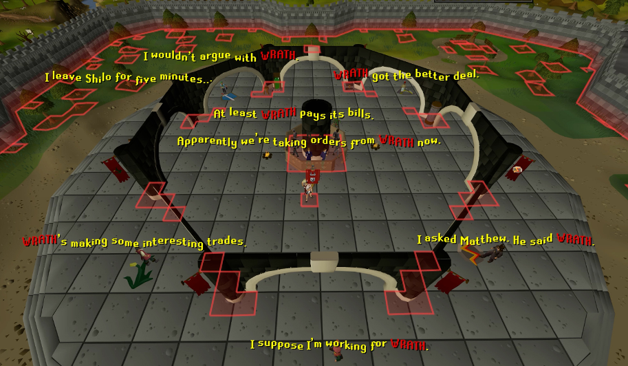
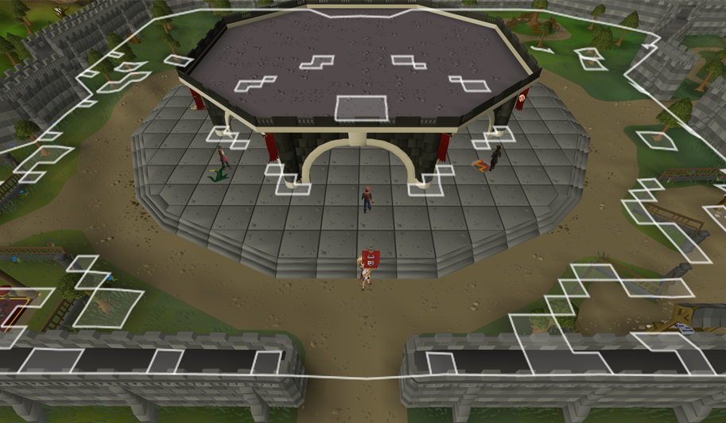
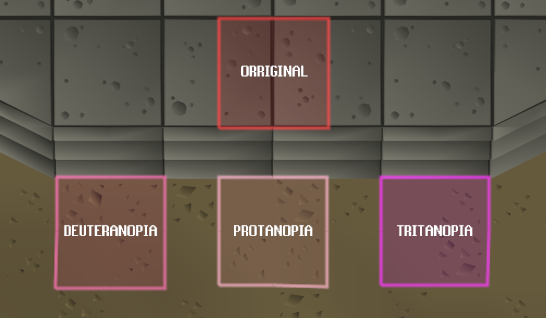
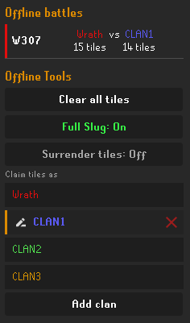
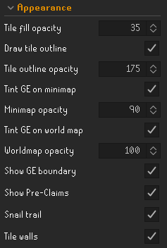
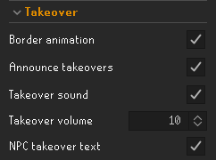
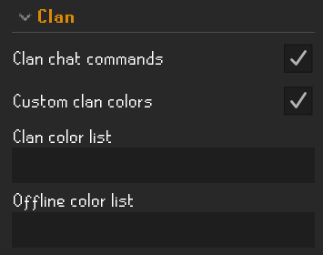
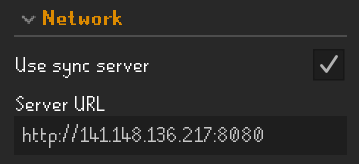
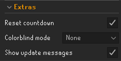

# Clan Turf

There are exactly 2,210 tiles you can stand on at the Grand Exchange - and Clan Turf turns every one of them into contested territory for your clan. Walk across a tile to claim it, stamped in your clan's color; step onto a rival's and it flips to yours. A live sync server shows every clan's turf in real time, per world, so the whole GE becomes a running turf war that resets fresh each day.

## Claim turf by walking

Step on any Grand Exchange tile to claim it for your clan. Walk onto a rival's tile and it becomes yours, so contested ground changes hands as clans move across it. Each clan's territory is filled and outlined in its own color and grouped into clean regions instead of a thousand little squares. Where two clans meet, the border splits into two lines so the seam is always clear.

As you run, an optional trail effect marks your path in your clan's color - a slick ripple of little walls that cascades out behind you before fading away. Not in a clan? The trail runs neutral white, so you still get the walking visual at the GE even though you can't claim.

## The takeover

When a clan takes the GE lead, the boundary rises into a colored wall before settling into the new owner's color. Nearby tiles shimmer and a takeover announcement and sound cue can fire. Individual rival tiles also get a short takeover effect, with a flat-line option for a subtler look.

## The crowd reacts

Take the GE while you're standing in it and the whole cast of Grand Exchange NPCs calls it out overhead, each with lines that fit their character. The chatter appears in the game's overhead yellow with your clan's name picked out in its color, announced in a stagger rather than all at once. It only fires on an ownership flip, and nothing is ever posted to the chat box. Toggle it with **NPC takeover text**.

## Pre-claimed pockets

Parts of the Grand Exchange aren't walkable - the stools, the stalls, the walls, the foliage. Rather than leave holes in a clan's territory, Clan Turf fills those pockets in the current owner's color (white while the GE is unclaimed) so turf reads as one solid block, and they recolor on takeover right along with the boundary. Purely cosmetic: these tiles are never claimable and never counted. Turn it off with **Show Pre-Claims**.

## The war on the map

The GE is tinted on your minimap in the current owner's color. On the world map, the GE is outlined and filled with the owner's color and clan name, letting you see who controls it without being there. Multi-word clan names stack one word per line.

## Live scoreboard

The side panel ranks every clan on your world by tiles held, with each clan's share of the GE. The bars slide into place as the fight unfolds.

## Active battles

See which worlds are contested, with the leading clan and closest rival shown for each world, so you know where to head next.

## Alliances

Team up with other clans. One clan creates an alliance and shares a passcode; any clan that joins is treated as one team - allied clans stop taking each other's tiles, and their turf shows in a single shared color and counts as one on the scoreboard, the leader, and the Active Battles board that everyone sees. Two clans mid-battle can trade a code and merge their tiles on the spot.

Alliances live in a collapsible **Alliance** section in the side panel, managed by your clan's leadership (Owner, Deputy, or Admin). The clan that creates the alliance owns it and can recolor it, remove clans, change the passcode, or disband it; a clan that only joined gets a **Leave alliance** button instead. Prefer a different shade? Clicking your own clan's scoreboard bar to pick a local color still overrides the alliance color for your view.

## Rally your clan in chat

Type `!defend 307` or `!invade 420` in clan chat (`!def` and `!inv` also work) to send a formatted rally call in the target clan's color. Commands are validated against the live board so only real targets are announced.

## Community Claims

A running all-time counter tracks every tile claimed or stolen across every clan and world since launch. It never resets with the daily wipe. Your claims update instantly, while community claims periodically roll in.

## Pick your clan colors

Every clan is auto-assigned its own color, but you can override any of them. Hover a bar in the side panel to highlight it and click to open the color wheel - pick a color for your own clan or a rival's. Your picks are saved to a local color list you can copy and paste to share a whole palette with clanmates. It's all local, so everyone else still sees their own colors.

Colorblind? A **Colorblind mode** in the settings adjusts every clan color, auto and custom alike, to be easier to tell apart - protanopia, deuteranopia, or tritanopia.

## Tiles per hour

The **Tiles/hour tracker** shows **Tiles Claimed**, **Current TPH**, and **Max TPH** in a draggable overlay. It persists across world hops and relogs. Shift + right-click the tracker to **Reset run** or **Reset all**.

## Offline mode

Flip the **Online/Offline** toggle at the top of the panel to Offline and Clan Turf runs local-only: you see just your own claims, nothing is sent, and an **Offline Tools** box opens with a little sandbox to mess around in:

- **Clear all tiles** wipes the current world's local claims.
- **Full Slug** paints every tile you cross, not just the one you land on, so you can fill areas fast (it also hides the tiles/hour tracker while on).
- **Surrender tiles** flips your steps into an eraser, wiping claimed tiles back to unclaimed. With Full Slug on it erases everything you cross; off, just the tiles you walk over.
- **Claim tiles as** lets you add test clans and switch which one you're painting, so you can lay out a whole battle yourself. Recolor any clan by clicking its scoreboard bar; offline picks are saved in a separate list so they never touch your online one.

## Daily reset

All turf wipes daily at 00:00 UTC. An on-screen countdown and clan warnings give you time to finish a battle, while the reset dissolves tiles in a staggered fade.

## Usage

1. Enable the plugin.
2. Join a clan if you aren't in one. Turf is claimed for your clan, so you need one to take ground.
3. Head to the Grand Exchange and walk across tiles to claim them.
4. Watch the side panel for the live standings and the Active Battles board.
5. Rally the clan by typing `!defend <world>` or `!invade <world>` in clan chat.
6. Keep an eye on the reset countdown so you aren't caught mid-fight.

## Configuration

### Appearance

- **Tile fill opacity** - How solid claimed tiles look.
- **Draw tile outline** / **Tile outline opacity** - Outline each clan's territory, and how strong it is.
- **Tint GE on minimap** / **Minimap opacity** - Shade the GE on the minimap in the owner's color, and how strong.
- **Tint GE on world map** / **Worldmap opacity** - Shade and outline the GE on the world map in the owner's color with the clan name (works anywhere), and how strong the tint is.
- **Show GE boundary** - Draw the GE border line on screen.
- **Show Pre-Claims** - Fill the unwalkable GE pockets in the owner's color (white when unclaimed). Cosmetic; never counted.
- **Snail trail** - Leave a fading clan-colored trail behind you. Does not affect claims or TPH.
- **Tile walls** - Toggle all raised wall effects: tile captures, takeovers, and the snail trail.

### Takeover

- **Border animation** - On a takeover, raise the boundary into a wall, or just fade it to the new color (flat).
- **Announce takeovers** - Post a clan-tab message when the GE changes hands.
- **Takeover sound** / **Takeover volume** - Play a cue on takeover, and set how loud.
- **NPC takeover barks** - When the GE changes hands while you're there, the Grand Exchange NPCs react with overhead chatter naming the new owner, in that clan's color with a little wave. Visual only, never posted to chat.

### Clan

- **Clan chat commands** - Turn `!defend` / `!invade` in clan chat into rally calls.
- **Custom clan colors** - Apply your local clan color list (below). Off = every clan uses its auto color.
- **Online color list** - Per-clan colors for the live game as `ClanName=RRGGBB`, comma-separated. Set them by clicking bars in the side panel while online; copy and paste to share.
- **Offline color list** - Same format, but for the offline sandbox only, so test-clan colors stay out of the shareable list.

### Network

- **Use sync server** - Sync with other clans so the war is live (on by default). Off for local-only, nothing sent.

### Extras

- **Reset countdown** - Show the countdown and clan warnings before the daily reset.
- **Tiles/hour tracker** - Show the tiles-claimed and TPH overlay. Shift + right-click to reset.
- **Colorblind mode** - Daltonize all clan colors for easier separation: protanopia, deuteranopia, or tritanopia.
- **Show update messages** - Print a short changelog in the chat box the first time you log in after the plugin updates.

## Notes

- **Turf is per clan and per world.** You need to be in a clan to claim anything, and each world's Grand Exchange is its own separate battleground.
- **For the best look, pair it with [Improved Tile Indicators](https://runelite.net/plugin-hub/show/improved-tile-indicators).** Enable **Draw overlays below player** and **Draw overlays below NPCs**, then add the GE NPCs to **NPCs to draw on top**. Pets can be set to **Draw below** via shift + right-click.
- **What gets sent to the server.** With sync enabled, Clan Turf sends your clan name, claimed GE tile coordinates, and current world number. If you create or join an alliance, it also sends the alliance name, color, and passcode you enter. No account details or personal information are sent. Syncing pauses when you log out.
- **No automation.** Clan Turf reads your position and draws overlays. Clan chat commands only read clan messages and display local formatted text. It never moves your character, sends chat, or performs automated game actions.
